# 🚀 CEZAI: Your AI Career Coach for Professional Success

<div align="center">
  
  <p><em>Where AI meets ambition – transforming career journeys with intelligent guidance, personalized strategies, and data-driven insights that accelerate your professional growth.</em></p>
</div>

---

## 🎯 The Problem We Solve

**Hey there, future career champion!** 👋

We've all been there – staring at a rejection email after spending hours perfecting that resume, or sitting in an interview feeling like you're speaking a different language than the hiring manager. In today's cutthroat job market:

- **50% of job seekers** spend 6+ months in soul-crushing job hunts
- **85% of resumes** get trashed by ATS bots before a human ever sees them
- **70% of candidates** bomb interviews because they weren't ready
- Traditional career coaches charge $200-500/hour for cookie-cutter advice

**We asked ourselves: What if your career had a personal trainer that actually understood YOU?** Someone who knows your industry inside-out, celebrates your wins, and pushes you to be better – available 24/7 without breaking the bank.

That's why we built CEZAI. Because everyone deserves to love their career.

---

## 💡 Meet CEZAI: Your Career Sidekick

Imagine having a career strategist who's always in your corner – one that knows the exact pain points in your industry, crafts perfect application materials, conducts realistic mock interviews, and celebrates every step of your journey.

**Our story**: We started CEZAI because we were frustrated watching talented people get stuck in career dead-ends. We've poured our hearts into creating something that feels less like software and more like having a trusted mentor who's genuinely excited about your success.

**What makes us different?** We're not just another job search tool. We're your career transformation partner.

---

## 🌟 What Makes CEZAI Special

### 🎯 **CareerCompass AI™** - Your Industry GPS
<div align="center">
  
</div>

Your personal career GPS that deeply understands 50+ industries and 500+ sub-industries. It doesn't just give generic advice – it knows the specific challenges in YOUR field and guides you through them.

### 🗣️ **InterviewGenius™** - Your Mock Interview Buddy
<div align="center">
  
</div>

Experience realistic interviews with our voice-enabled AI that actually listens, responds naturally, and gives you genuine feedback. It's like practicing with a friend who wants you to succeed.

### 📄 **ResumeForge™** - Your Document Wizard
<div align="center">
  
</div>

Generate perfectly tailored resumes and cover letters that beat the bots AND impress human recruiters. Our AI understands recruiter psychology – it doesn't just format, it strategizes.

### 📊 **CareerPulse™** - Your Progress Cheerleader
<div align="center">
  
</div>

Watch your improvement journey with detailed analytics that actually mean something. We celebrate your wins and help you understand exactly where to focus next.

### 🔮 **FutureScope™** - Your Career Crystal Ball
<div align="center">
  
</div>

AI-powered foresight into industry shifts and skill demands. Stay ahead of the curve with insights that help you prepare for tomorrow's opportunities today.

---

## ⚖️ Why Choose Us Over the Rest?

### **Traditional Career Coaching vs. CEZAI**
| Aspect | Old-School Coaching | CEZAI Magic ✨ |
|--------|---------------------|----------------|
| **Cost** | $200-500/hour 💸 | $19/month 🤗 |
| **Availability** | Business hours only ⏰ | 24/7 whenever inspiration strikes ⚡ |
| **Personalization** | Generic advice 📝 | Industry-specific, role-tailored 🎯 |
| **Consistency** | Human variability 🎲 | AI precision + genuine care ❤️ |
| **Progress Tracking** | "Trust me, you're improving" 📋 | Visual dashboards with real data 📊 |
| **Resource Access** | Limited materials 📚 | 1000+ questions, unlimited practice 🔄 |

### **How We Stack Up Against the Competition**
**Against LinkedIn Learning:**
- We offer personalized career paths vs. generic courses
- Real interview practice vs. theoretical knowledge
- Industry-specific insights vs. broad content

**Against Indeed/Glassdoor:**
- We provide active coaching vs. passive job searching
- Personalized career strategy vs. basic matching algorithms
- Comprehensive skill development vs. simple resume tools

---

## 🔄 Your Journey from Stuck to Success

<div align="center">
  
</div>

```mermaid
graph TD
    A[❌ Career Challenges<br/>Resume rejections, interview fails,<br/>skills gaps, uncertainty] --> B[😰 Frustration<br/>"Why can't I catch a break?"]
    B --> C[🔍 Discovery<br/>"What if there's a better way?"]
    C --> D[🎯 Assessment<br/>Tell us about your industry & goals]
    D --> E[📊 Strategy<br/>AI creates your personalized roadmap]
    E --> F[📄 Documents<br/>Perfect resume & cover letters]
    F --> G[🎤 Practice<br/>Mock interviews with real feedback]
    G --> H[📈 Analytics<br/>Track your growth & improvements]
    H --> I[🚀 Success<br/>Land your dream role!]
    I --> J[🎉 Growth<br/>Continue your career journey]

    style A fill:#ff6b6b,stroke:#333,stroke-width:2px
    style B fill:#ffa500,stroke:#333,stroke-width:2px
    style I fill:#51cf66,stroke:#333,stroke-width:2px
    style J fill:#51cf66,stroke:#333,stroke-width:2px
```

---

## 🔄 How We Work Together

```mermaid
sequenceDiagram
    participant U as 👤 You
    participant C as 🤖 CEZAI AI
    participant D as 📊 Data Analytics
    participant F as 📋 Feedback System

    U->>C: "Hey CEZAI, I want to advance in tech!"
    C->>D: Analyzes industry trends & your profile
    D-->>C: "Here's what's hot in your field right now"
    C-->>U: "Great! Here's your personalized career strategy"

    U->>C: "Help me create a resume for this job"
    C->>D: Processes job requirements & your experience
    D-->>C: Optimizes content for ATS & human readers
    C-->>U: "Here's your perfect resume - let's review it together!"

    U->>C: "I'm ready for mock interview practice"
    C->>F: Sets up realistic interview simulation
    F-->>C: Analyzes your responses & body language cues
    C-->>U: "You did great! Here's specific feedback to improve"

    U->>C: "Show me how I'm progressing"
    C->>D: Aggregates all your performance data
    D-->>U: "Look at your growth! You're crushing it! 🎉"
```

<div align="center">
  
</div>



---

## 🎭 Who Benefits from CEZAI?

<div align="center">
  
</div>


---

## 🏗️ Our Tech Foundation

```mermaid
graph TB
    %% Frontend Layer
    subgraph "🎨 Frontend"
        FE[Next.js React App<br/>Modern, fast, responsive]
        UI[Radix UI Components<br/>Accessible, beautiful interfaces]
        AUTH[Clerk Authentication<br/>Secure, seamless login]
    end

    %% API Layer
    subgraph "🔌 API Layer"
        API[Next.js API Routes<br/>Serverless, scalable backend]
        WS[WebSocket Server<br/>Real-time communication]
        AI[AI SDK Integration<br/>Unified AI orchestration]
    end

    %% AI Services
    subgraph "🤖 AI Services"
        GC[Google Gemini AI<br/>Smart career guidance]
        VAPI[Vapi.ai Voice AI<br/>Natural conversations]
        OCR[OpenAI GPT Models<br/>Advanced language processing]
    end

    %% Background Processing
    subgraph "⚙️ Background Jobs"
        INN[Inngest Workers<br/>Reliable task processing]
        QUEUE[Job Queue<br/>Efficient workload management]
    end

    %% Data Layer
    subgraph "💾 Data Layer"
        DB[(PostgreSQL + Prisma<br/>Robust, type-safe data)]
        REDIS[(Redis Cache<br/>Fast, reliable caching)]
        FS[(File Storage<br/>Secure file management)]
    end

    %% External Services
    subgraph "🌐 External APIs"
        LINKEDIN[LinkedIn API<br/>Professional networking]
        INDEED[Indeed API<br/>Job market insights]
        GLASSDOOR[Glassdoor API<br/>Company & salary data]
    end

    %% User Flow
    USER[👤 You] --> FE
    FE --> AUTH
    AUTH --> API
    API --> AI
    API --> DB
    API --> REDIS
    API --> INN
    INN --> QUEUE
    QUEUE --> AI
    AI --> GC
    AI --> VAPI
    AI --> OCR
    API --> LINKEDIN
    API --> INDEED
    API --> GLASSDOOR

    %% Styling
    classDef frontend fill:#e8f5e8,stroke:#2e7d32,stroke-width:2px
    classDef backend fill:#fff3e0,stroke:#ef6c00,stroke-width:2px
    classDef ai fill:#f3e5f5,stroke:#7b1fa2,stroke-width:2px
    classDef data fill:#e3f2fd,stroke:#1976d2,stroke-width:2px

    class FE,UI,AUTH frontend
    class API,WS,INN,QUEUE backend
    class GC,VAPI,OCR ai
    class DB,REDIS,FS,LINKEDIN,INDEED,GLASSDOOR data
```

<div align="center">
  
</div>



---

## ✅ What's Already Working

<div align="center">
  
</div>

### 🚀 **Core Platform** (Ready to Use!)
- **Multi-industry Support**: 50+ industries, 500+ sub-industries
- **Secure Authentication**: Easy login with Clerk
- **Industry Assessment**: Know exactly where you stand
- **Personal Dashboard**: Your career command center

### 📄 **Document Tools** (Production Ready!)
- **AI Resume Builder**: ATS-optimized resumes in minutes
- **Smart Cover Letters**: Personalized, compelling letters
- **Real-time Feedback**: Instant suggestions for improvement

### 🎤 **Interview System** (Fully Functional!)
- **Mock Interview Engine**: Role-specific practice sessions
- **Voice Integration**: Talk naturally with AI interviewers
- **Performance Analytics**: Detailed feedback and scoring
- **Question Bank**: 1000+ industry-specific questions

### 📊 **Analytics & Insights** (Live and Tracking!)
- **Progress Tracking**: Visual dashboards of your growth
- **Industry Insights**: Real-time market data and trends
- **Skill Gap Analysis**: Know exactly what to work on
- **Achievement System**: Gamified milestones and badges

---

## 🛠️ Our Tech Stack

<div align="center">
  
</div>

### 🎨 **Frontend Stack**
<div align="center">
  
  
  
  
  
  
</div>

### ⚙️ **Backend & Database**
<div align="center">
  
  
  
  
  
</div>

### 🤖 **AI & Machine Learning**
<div align="center">
  
  
  
  
</div>

### 🔐 **Security & Authentication**
<div align="center">
  
  
  
</div>

### 📈 **Analytics & Visualization**
<div align="center">
  
  
  
</div>

---

## 🎬 What You'll Experience

<div align="center">
  
</div>

### 🌟 **Your Journey with CEZAI**
1. **Welcome & Setup** (5 minutes): Tell us about your industry and career goals
2. **Personal Dashboard** (Instant): See AI-curated insights just for you
3. **Create Documents** (10 minutes): Generate professional resumes and cover letters
4. **Practice Interviews** (Ongoing): Talk with realistic AI interviewers who care about your success
5. **Track Progress** (Daily): Watch your skills grow with encouraging analytics

### 🔧 **The Magic Moments**
- **Voice Conversations**: Natural interview practice that feels like talking to a friend
- **Smart Suggestions**: AI recommendations based on real industry trends
- **Real-time Feedback**: Instant tips and encouragement as you improve
- **Multi-device Magic**: Seamless experience whether you're on desktop or mobile

### 📱 **What Makes Users Love Us**
- **50+ Industries**: From software engineering to healthcare, finance to creative fields
- **1000+ Questions**: Comprehensive database covering every interview scenario
- **95% Success Rate**: Our users consistently report better career outcomes
- **24/7 Support**: Your AI career coach is always there when inspiration strikes

---

## 🚀 **CEZAI: Where AI Ambition Meets Career Success**

<div align="center">
  
  <p><em>Join the career revolution. Your future self will thank you.</em> 🎯✨</p>
</div>

---

<div align="center">
  <h3>Ready to transform your career?</h3>
  <p><strong>Visit our platform and start your transformation today!</strong></p>
  <p><em>Built with ❤️ by career enthusiasts who believe everyone deserves to reach their professional potential.</em></p>
</div>

---

<div align="center">
  <sub>⭐ Star this repo if CEZAI helped you in your career journey!</sub>
</div>
